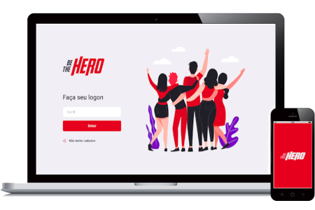

   
  
 Aplicação criada para auxiliar organizações não governamentais em suas campanhas finaceiras! <strong> Be The Hero </strong>
  

  
  
  
  
  
  

### Sobre o Projeto:

O Be The Hero é um projeto que foi desenvolvido durante a Semana OmniStack 11.0, um evento da @Rocketseat, onde construimos uma aplicação completa com Node.js no back-end, ReactJS no front-end e React Native no mobile.

### Como rodar a aplicação

Para executar a aplicação, faça o clone desse reposítorio e utilize seu gerenciador de pacote favorito **NPM** ou **YARN** e rode o comando `npm-install` para adicionar todas as depências necessárias.

> OBS: é Necessário rodar o comando `npm-install` em cada uma das pastas: **SERVER**, **WEB** e **MOBILE**.

Depois rode a aplicação utilizando o comando `npm-start`.

> OBS: O `npm-start` também precisa ser executado em cada uma das pastas, o contrário disso, não funcionará.

**OBRIGADO POR VISITAR MEU REPOSITÓRIO.**

